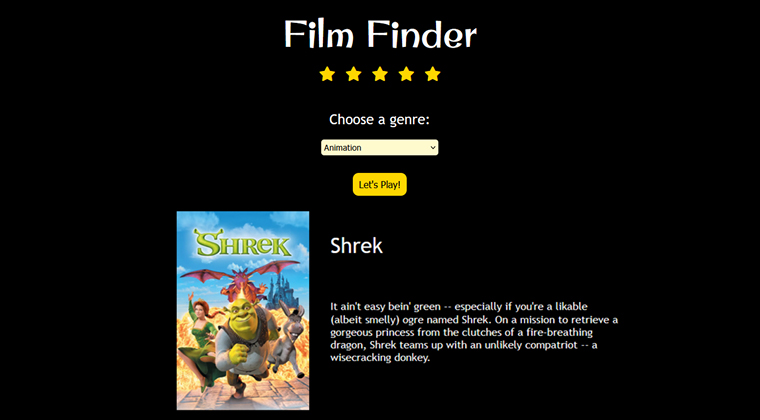

## Film Finder — API & HTTP Requests Practice

This project was completed as part of the **Film Finder** exercise from Codecademy, focused on working with external APIs, making HTTP requests, and handling asynchronous JavaScript. The main goal was to understand how data flows from an API into a frontend interface and how to work with the returned information.

### 🎯 Purpose of the Exercise
- Practice making HTTP requests with `fetch()`
- Work with API responses and JSON data
- Understand async/await flow and the Response object
- Focus on API interaction rather than building a layout from scratch

### 🧩 What I Practiced
- Fetching movie data from an external movie database API
- Working with async/await to handle asynchronous requests
- Reading the `Response` object and converting JSON into JavaScript objects
- Accessing and using returned data properties to render specific information in the UI
- Modifying and adapting an existing CSS structure to adjust the visual appearance
- Making small UI adjustments while keeping the original HTML structure mostly unchanged

### 🎨 Implementation Notes
- The exercise was developed locally instead of the Codecademy environment.
- Visual styling was customized to better match my own preferences.
- The HTML structure was largely preserved since the main focus was API interaction and data handling.

### ▶️ Running Locally
1. Clone or download the project.
2. Duplicate the `config.example.js` file and rename it to `config.js`.
3. Add your own API key inside `config.js`.
4. Run the project using any local development server.

> The `config.js` file is ignored from version control to avoid committing personal API keys.

### 🎬 Data Source
Movie data displayed in this project is provided by **[The Movie Database (TMDB)](https://www.themoviedb.org/)** API.  
An API key from TMDB is required to fetch movie information such as titles, posters, and descriptions.